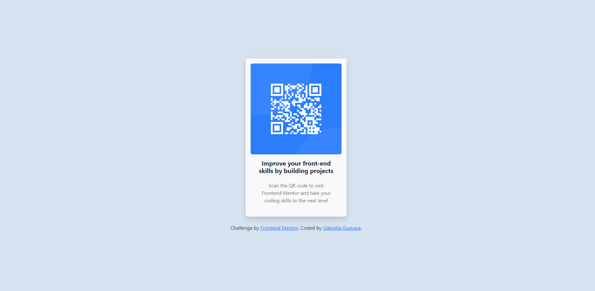

# Frontend Mentor - QR code component solution

This is a solution to the [QR code component challenge on Frontend Mentor](https://www.frontendmentor.io/challenges/qr-code-component-iux_sIO_H). Frontend Mentor challenges help you improve your coding skills by building realistic projects. 

## Table of contents

- [Overview](#overview)
  - [Screenshot](#screenshot)
  - [Links](#links)
- [My process](#my-process)
  - [Built with](#built-with)
  - [What I learned](#what-i-learned)
- [Author](#author)

## Overview

### Screenshot



### Links

- Solution URL: [Solution URL](https://github.com/GabrielaGuayara/qrCodeWithBootstrap)
- Live Site URL: [Website URL](https://qrcodewithbootstrap.netlify.app/)

## My process

### Built with

- Semantic HTML5 markup
- Inline CSS
- Bootstrap


### What I learned

I learned how to implement Bootstrap into my HTML file. I also learned how to use Bootstrap layouts and components.

```html
<head>
  ...
  <link href="https://cdn.jsdelivr.net/npm/bootstrap@5.3.3/dist/css/bootstrap.min.css" rel="stylesheet" integrity="sha384-QWTKZyjpPEjISv5WaRU9OFeRpok6YctnYmDr5pNlyT2bRjXh0JMhjY6hW+ALEwIH" crossorigin="anonymous">

</head>
<body>

  ...  
  <script src="https://cdn.jsdelivr.net/npm/bootstrap@5.3.3/dist/js/bootstrap.bundle.min.js" integrity="sha384-YvpcrYf0tY3lHB60NNkmXc5s9fDVZLESaAA55NDzOxhy9GkcIdslK1eN7N6jIeHz" crossorigin="anonymous"></script>
</body>

```

## Author
Gabriela Guayara
- Website - [QR Code Challenge With Bootstrap](https://qrcodewithbootstrap.netlify.app/)

